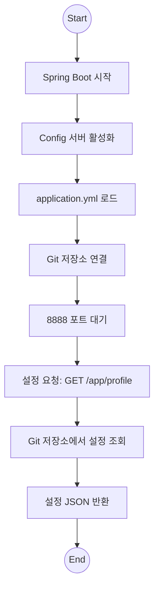

```mermaid
flowchart TD
    start((Start))
    start --> configInit[Spring Boot 시작]
    configInit --> enableConfig[Config 서버 활성화]
    enableConfig --> loadProps[application.yml 로드]
    loadProps --> connectGit[Git 저장소 연결]
    connectGit --> listenPort[8888 포트 대기]
    listenPort --> configReq[설정 요청: GET /app/profile]
    configReq --> fetchConfig[Git 저장소에서 설정 조회]
    fetchConfig --> returnJson[설정 JSON 반환]
    returnJson --> endNode((End))
```